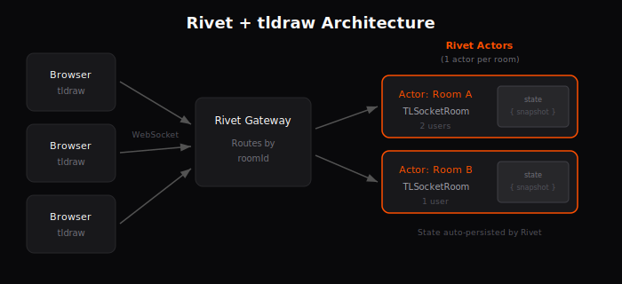

# tldraw sync with Rivet

Real-time multiplayer for [tldraw](https://tldraw.dev) powered by [Rivet](https://rivet.dev) actors.

## What's included

- **Real-time collaboration** - Multiple users can draw on the same canvas simultaneously
- **Automatic persistence** - Room state is saved automatically by Rivet
- **Scalable architecture** - Each room runs in its own actor instance
- **Asset storage ready** - Hooks for uploading images and videos (bring your own storage)
- **Bookmark previews** - URL metadata fetching for link shapes

## Architecture

<p align="center">
  
</p>

Each tldraw room maps to a Rivet actor. When users join a room:

1. **Browser** → Connects to the **Rivet Gateway** via WebSocket
2. **Gateway** → Routes the connection to the appropriate **Actor** based on room ID
3. **Actor** → Runs `TLSocketRoom` from `@tldraw/sync-core`, managing document state
4. **Persistence** → Actor state (snapshots) is automatically persisted by Rivet

Changes are broadcast instantly to all connected users. Rivet handles actor lifecycle, persistence, and routing automatically. Actors auto-scale and shut down when rooms are empty.

## Quick start

```bash
yarn install
yarn dev
```

Open http://localhost:5173 to start drawing. Share the URL to collaborate.

## Project structure

```
server/
  registry.ts    # Actor definition with TLSocketRoom
  server.ts      # Starts the Rivet registry

client/
  pages/
    Room.tsx     # Connects to actor and renders tldraw
    Root.tsx     # Generates room IDs
  multiplayerAssetStore.tsx   # Asset upload/download hooks
  getBookmarkPreview.tsx      # URL metadata fetching
```

## Configuration

Environment variables:

- `VITE_RIVET_ENDPOINT` - Rivet server URL (default: `http://localhost:6420`)
- `VITE_RIVET_TOKEN` - Optional auth token for production

## S3 asset storage (optional)

Asset uploads (images, videos) can be stored in S3 or any S3-compatible storage (MinIO, Cloudflare R2, etc.).

### Local development with MinIO

```bash
./scripts/start-minio.sh
```

This starts a MinIO container and outputs the export commands to configure S3.

### Environment variables

- `S3_ACCESS_KEY` - AWS access key ID
- `S3_SECRET_KEY` - AWS secret access key
- `S3_BUCKET` - S3 bucket name
- `S3_REGION` - AWS region (default: `us-east-1`)
- `S3_ENDPOINT` - Custom endpoint URL (optional, for S3-compatible services)

### How it works

1. Client requests a presigned upload URL from `/api/uploads/:objectName`
2. Client uploads directly to S3 using the presigned URL
3. Assets are stored with the path `/api/uploads/:objectName`
4. When retrieving assets, the server redirects to a presigned S3 download URL

Without S3 configured, asset uploads will return a 503 error. The sync functionality works without S3.

## Adding custom shapes

See the [tldraw sync docs](https://tldraw.dev/docs/sync#Custom-shapes--bindings) for extending the schema.

## Adding Rivet to your existing app

If you already have an app using tldraw and want to add Rivet sync, you can copy the relevant parts to your own app.

**Server setup:**

1. Copy the [`server/`](./server/) folder to your app
2. Add the dependencies from [`package.json`](./package.json): `rivetkit`, `@tldraw/sync-core`, `@tldraw/tlschema`, `lodash.throttle`, and `hono`
3. For S3 asset storage, also add `@aws-sdk/client-s3` and `@aws-sdk/s3-request-presigner`

**Client setup:**

1. Copy [`client/multiplayerAssetStore.tsx`](./client/multiplayerAssetStore.tsx) and [`client/getBookmarkPreview.tsx`](./client/getBookmarkPreview.tsx) to your app
2. Add `rivetkit` to your client dependencies
3. Adapt the code from [`client/pages/Room.tsx`](./client/pages/Room.tsx) to connect to the Rivet actor:

```tsx
import { useSync } from '@tldraw/sync'
import { createClient } from 'rivetkit/client'

const client = createClient()

// In your component:
const gatewayUrl = await client.tldrawRoom.getOrCreate(roomId).getGatewayUrl()
const store = useSync({
	uri: `${gatewayUrl}/websocket`,
	assets: multiplayerAssetStore,
})
```

## Deployment

See [Rivet's deployment guide](https://rivet.dev/docs/connect) for deploying to Vercel, Railway, Kubernetes, AWS, and other platforms.

## License

MIT. The tldraw SDK uses the [tldraw license](https://github.com/tldraw/tldraw/blob/main/LICENSE.md).

## Community

Have questions, comments or feedback? [Join the Rivet Discord](https://rivet.gg/discord). Found a bug? Please [submit an issue](https://github.com/rivet-gg/rivet/issues/new) or start a [discussion](https://github.com/rivet-gg/rivet/discussions) on GitHub.
